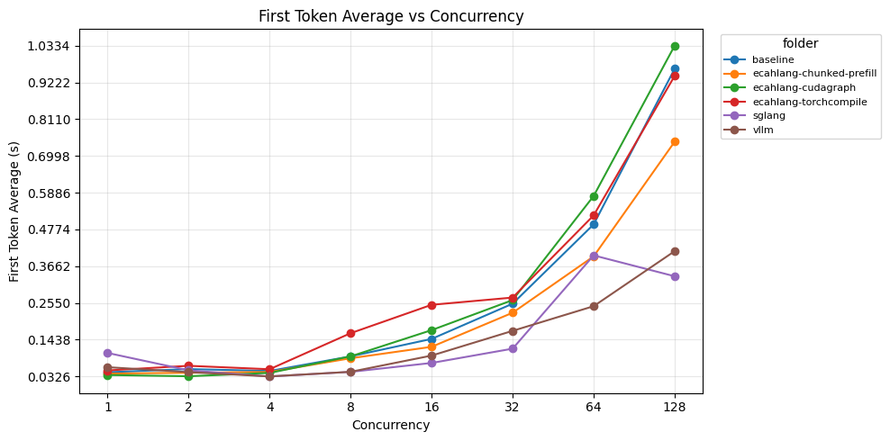
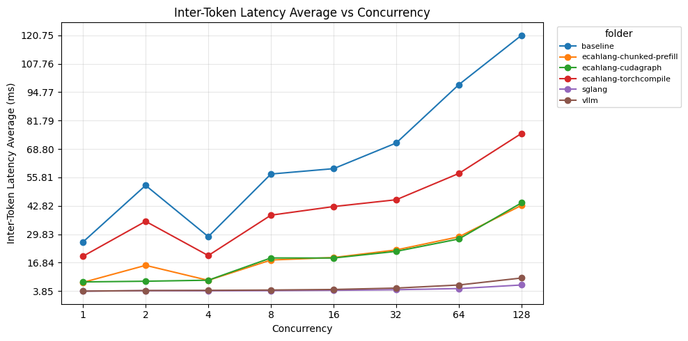
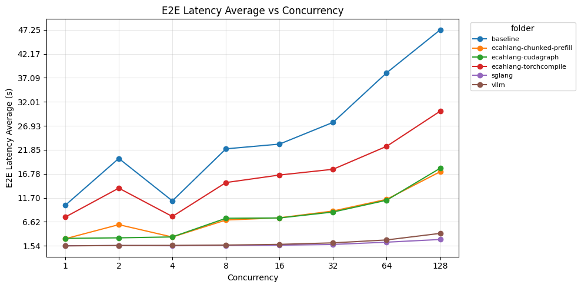

# ecahLang

Lightweight continuous batching inference engine for HuggingFace CausalLM models, built on [FlashInfer](https://github.com/flashinfer-ai/flashinfer).

## Features

- Continuous batching with paged KV cache
- FlashInfer paged prefill and decode attention
- CUDA Graph decode
- torch.compile decode
- CUDA stream overlap schedule
- Pre-allocated pinned sampling buffers
- Chunked prefill

## Pre-requisites

```bash
curl -LsSf https://astral.sh/uv/install.sh | sh

uv venv --python 3.12
source .venv/bin/activate
```

## Installation

```bash
pip install git+https://github.com/Scicom-AI-Enterprise-Organization/ecahLang
```

Or from source:

```bash
git clone https://github.com/Scicom-AI-Enterprise-Organization/ecahLang && cd ecahLang
pip install -e .
```

## Quick Start

Run ecahLang with CUDA Graph enabled for the best decode performance. The server will warm up FlashInfer and capture decode graphs at startup, then serve requests on an OpenAI-compatible API.

```bash
CUDA_VISIBLE_DEVICES=0 python3 -m ecahlang \
  --model Qwen/Qwen2.5-3B-Instruct \
  --torch_dtype float16 \
  --host 0.0.0.0 --port 7088 \
  --memory_utilization 0.5 \
  --cuda_graph true
```

```bash
curl -X POST http://localhost:7088/chat/completions \
  -H 'Content-Type: application/json' \
  -d '{
    "messages": [{"role": "user", "content": "Hello!"}],
    "max_tokens": 256,
    "stream": true
  }'
```

## Supported Parameters

```bash
python3 -m ecahlang --help
```

```text
usage: __main__.py [-h] [--host HOST] [--port PORT] [--loglevel LOGLEVEL] [--microsleep MICROSLEEP]
               [--max_sequence MAX_SEQUENCE] [--memory_utilization MEMORY_UTILIZATION]
               [--compare-sdpa-prefill COMPARE_SDPA_PREFILL] [--model MODEL] [--torch_dtype TORCH_DTYPE]
               [--torch_dtype_autocast TORCH_DTYPE_AUTOCAST] [--torch_profiling TORCH_PROFILING]
               [--torch_compile TORCH_COMPILE] [--torch_compile_mode TORCH_COMPILE_MODE] [--cuda_graph CUDA_GRAPH]

ecahLang - Continuous Batching LLM Inference

options:
  -h, --help            show this help message and exit
  --host HOST           host name to host the app (default: 0.0.0.0, env: HOSTNAME)
  --port PORT           port to host the app (default: 7088, env: PORT)
  --loglevel LOGLEVEL   Logging level (default: INFO, env: LOGLEVEL)
  --microsleep MICROSLEEP
                        microsleep to group batching, 1 / 1e-4 = 10k steps/sec (default: 0.0001, env: MICROSLEEP)
  --max_sequence MAX_SEQUENCE
                        max batch size per prefill or decode step (default: 128, env: MAX_SEQUENCE)
  --memory_utilization MEMORY_UTILIZATION
                        fraction of free GPU memory for KV cache pages (default: 0.9, env: MEMORY_UTILIZATION)
  --compare-sdpa-prefill COMPARE_SDPA_PREFILL
                        compare FlashInfer attention output with SDPA during prefill (default: False, env: COMPARE_SDPA_PREFILL)
  --model MODEL         HuggingFace model name or path (default: meta-llama/Llama-3.2-1B-Instruct, env: MODEL)
  --torch_dtype TORCH_DTYPE
                        model dtype: float16, bfloat16, float32 (default: float16, env: TORCH_DTYPE)
  --torch_dtype_autocast TORCH_DTYPE_AUTOCAST
                        autocast dtype when model is float32 (default: float16, env: TORCH_DTYPE_AUTOCAST)
  --torch_profiling TORCH_PROFILING
                        profile prefill and step with torch profiler (default: False, env: TORCH_PROFILING)
  --torch_compile TORCH_COMPILE
                        torch.compile for decode (default: False, env: TORCH_COMPILE)
  --torch_compile_mode TORCH_COMPILE_MODE
                        torch.compile mode (default: default, env: TORCH_COMPILE_MODE)
  --cuda_graph CUDA_GRAPH
                        capture CUDA Graph for decode (default: False, env: CUDA_GRAPH)
```

**We support both args and OS environment.**

## Benchmarks

Benchmarked on **Qwen/Qwen2.5-3B-Instruct** (float16) across concurrency levels 1–128, compared against baseline (no optimizations), SGLang, and vLLM. Each request generates 384 tokens with `ignore_eos: true`.

### Time to First Token (TTFT)



### Inter-Token Latency (ITL)



### End-to-End Latency (E2E)



### Running the Benchmark

```bash
# Against ecahLang
python3 benchmark/benchmark.py \
  --model Qwen/Qwen2.5-3B-Instruct \
  --save benchmark/my-results \
  --concurrency-list 1,2,4,8,16,32,64,128

# Against vLLM/SGLang (uses /v1/completions)
python3 benchmark/benchmark.py \
  --model Qwen/Qwen2.5-3B-Instruct \
  --save benchmark/vllm-results \
  --vllm \
  --concurrency-list 1,2,4,8,16,32,64,128
```

Visualization notebook: [`benchmark/benchmark_visualization.ipynb`](benchmark/benchmark_visualization.ipynb)

## Project Structure

```
ecahlang/
├── env.py          # CLI args + environment variable config
├── main.py         # FastAPI app, process_queue, stream, startup
├── manager.py      # Paged KV cache manager + sampling buffers
├── parameters.py   # Pydantic request/response models
└── utils.py        # Attention mask utilities
benchmark/
├── benchmark.py                 # Stress test script
├── benchmark_visualization.ipynb # Visualization notebook
└── <results>/                   # JSON results per concurrency level
pics/                            # Benchmark graphs
```
